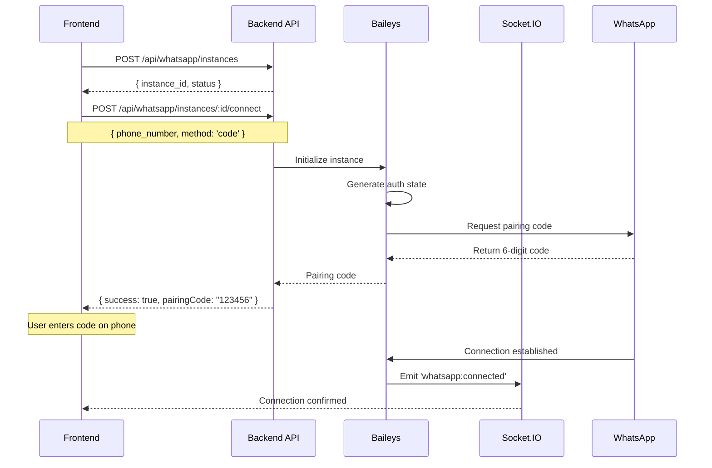
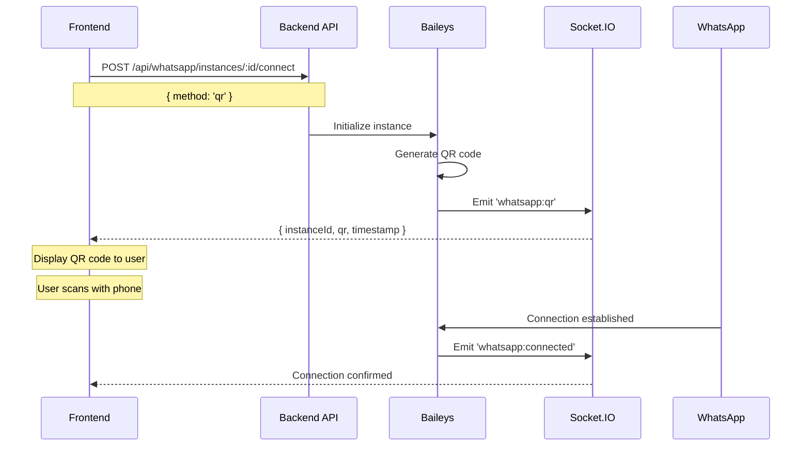
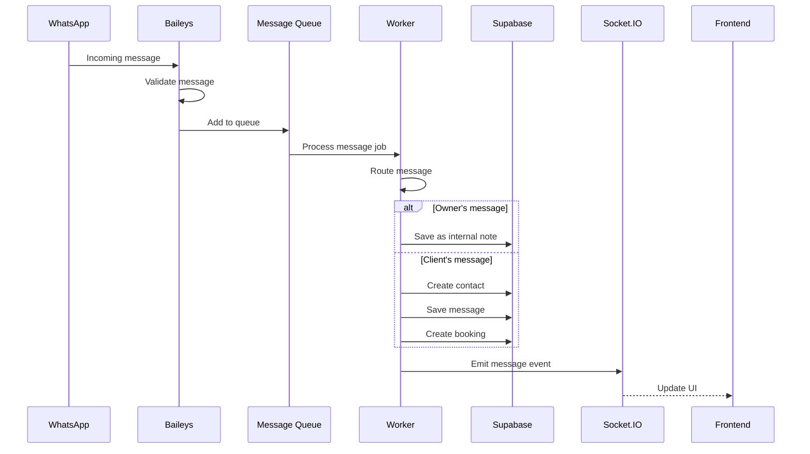

# WhatsApp Integration Documentation

## 📋 Table of Contents

- [Architecture Overview](#architecture-overview)
- [Connection Flow](#connection-flow)
- [Message Flow](#message-flow)
- [Routing Strategy](#routing-strategy)
- [API Reference](#api-reference)
- [Socket.IO Events](#socketio-events)
- [Troubleshooting](#troubleshooting)

---

## 🏗️ Architecture Overview

### Components

```
┌─────────────┐       ┌──────────────┐       ┌─────────────┐
│  Frontend   │◄─────►│   Socket.IO  │◄─────►│   Backend   │
│   (React)   │       │   (Real-time)│       │  (Express)  │
└─────────────┘       └──────────────┘       └─────────────┘
                              │                      │
                              ▼                      ▼
                      ┌──────────────┐       ┌─────────────┐
                      │  QR/Pairing  │       │   Baileys   │
                      │   Emissions  │       │   Service   │
                      └──────────────┘       └─────────────┘
                                                     │
                                                     ▼
                                             ┌─────────────┐
                                             │  WhatsApp   │
                                             │    API      │
                                             └─────────────┘
```

### Technology Stack

- **Backend**: Express.js + TypeScript
- **WhatsApp Client**: @whiskeysockets/baileys
- **Real-time**: Socket.IO
- **Database**: Supabase (PostgreSQL)
- **Queue**: Bull (Redis) - disabled in production without Redis
- **Logging**: Pino

---

## 🔐 Connection Flow

### Method 1: Pairing Code (Recommended)



#### Step-by-Step: Pairing Code

1. **Create Instance**
```bash
curl -X POST http://localhost:3000/api/whatsapp/instances \
  -H "Content-Type: application/json" \
  -d '{
    "organization_id": "org_123",
    "instance_name": "Main WhatsApp",
    "phone_number": "5511999887766"
  }'
```

2. **Connect with Pairing Code**
```bash
curl -X POST http://localhost:3000/api/whatsapp/instances/{instance_id}/connect \
  -H "Content-Type: application/json" \
  -d '{
    "phone_number": "5511999887766",
    "method": "code"
  }'
```

Response:
```json
{
  "success": true,
  "pairingCode": "ABCD1234",
  "method": "code"
}
```

3. **Enter Code on WhatsApp**
   - Open WhatsApp on your phone
   - Go to: Settings → Linked Devices → Link a Device
   - Select "Link with phone number instead"
   - Enter the 8-character code

4. **Wait for Connection Event**
```javascript
socket.on('whatsapp:connected', (data) => {
  console.log('Connected:', data);
  // { instanceId, timestamp, phone_number }
});
```

---

### Method 2: QR Code



#### Step-by-Step: QR Code

1. **Connect with QR**
```bash
curl -X POST http://localhost:3000/api/whatsapp/instances/{instance_id}/connect \
  -H "Content-Type: application/json" \
  -d '{
    "method": "qr"
  }'
```

2. **Listen for QR via Socket.IO**
```javascript
socket.on('whatsapp:qr', ({ instanceId, qr, timestamp }) => {
  // qr is a string that needs to be converted to QR image
  const qrImage = generateQRCode(qr); // Use qrcode.react or similar
  displayQRCode(qrImage);
});
```

3. **Scan QR Code**
   - Open WhatsApp on your phone
   - Go to: Settings → Linked Devices → Link a Device
   - Scan the displayed QR code

---

## 💬 Message Flow

### Receiving Messages



### Message Routing Logic

**Owner's Number**: Messages from this number are ignored or saved as notes.

**Client Numbers**: All other numbers trigger:
1. Contact creation (if not exists)
2. Message storage
3. Auto-booking creation
4. Real-time notification

### Sending Messages

```bash
curl -X POST http://localhost:3000/api/whatsapp/instances/{instance_id}/send \
  -H "Content-Type: application/json" \
  -d '{
    "to": "5511999887766",
    "message": "Hello from AuZap!"
  }'
```

```javascript
// Frontend example
const sendMessage = async (instanceId, to, message) => {
  const response = await fetch(`/api/whatsapp/instances/${instanceId}/send`, {
    method: 'POST',
    headers: { 'Content-Type': 'application/json' },
    body: JSON.stringify({ to, message })
  });

  return response.json();
};
```

---

## 🔀 Routing Strategy

### Owner Detection

```typescript
// Check if message is from owner
const isOwnerMessage = async (phoneNumber: string, organizationId: string) => {
  const { data } = await supabase
    .from('whatsapp_instances')
    .select('phone_number')
    .eq('organization_id', organizationId)
    .single();

  return data?.phone_number === phoneNumber;
};
```

### Client Message Processing

When a message is **not** from the owner:

1. **Extract Contact Info**
```typescript
const contactData = {
  phone_number: sender,
  name: senderName || 'Unknown',
  organization_id: organizationId
};
```

2. **Create/Update Contact**
```typescript
const { data: contact } = await supabase
  .from('contacts')
  .upsert(contactData, { onConflict: 'phone_number,organization_id' })
  .select()
  .single();
```

3. **Save Message**
```typescript
await supabase
  .from('messages')
  .insert({
    contact_id: contact.id,
    instance_id: instanceId,
    direction: 'inbound',
    content: messageText,
    whatsapp_message_id: msg.key.id
  });
```

4. **Auto-Create Booking**
```typescript
await supabase
  .from('bookings')
  .insert({
    contact_id: contact.id,
    organization_id: organizationId,
    status: 'pending',
    source: 'whatsapp'
  });
```

---

## 📚 API Reference

### Create Instance

**POST** `/api/whatsapp/instances`

Create a new WhatsApp instance.

**Request Body:**
```typescript
{
  organization_id: string;      // Required
  instance_name: string;        // Required
  phone_number?: string;        // Optional, used for pairing code
}
```

**Response:**
```typescript
{
  success: boolean;
  instance: {
    id: string;
    organization_id: string;
    instance_name: string;
    phone_number: string | null;
    status: 'disconnected';
    pairing_method: 'code';
    created_at: string;
  }
}
```

**Status Codes:**
- `200` - Instance created successfully
- `400` - Missing required fields
- `500` - Server error

---

### Connect Instance

**POST** `/api/whatsapp/instances/:id/connect`

Initialize connection to WhatsApp.

**Path Parameters:**
- `id` - Instance UUID

**Request Body:**
```typescript
{
  phone_number?: string;        // Required for 'code' method
  method?: 'code' | 'qr';      // Default: 'code'
}
```

**Response (Pairing Code):**
```typescript
{
  success: true;
  pairingCode: string;          // 8-character code
  method: 'code';
}
```

**Response (QR Code):**
```typescript
{
  success: true;
  method: 'qr';
  message: 'QR Code will be sent via Socket.IO when generated';
}
```

**Status Codes:**
- `200` - Connection initiated
- `404` - Instance not found
- `500` - Connection error

---

### Check Instance Status

**GET** `/api/whatsapp/instances/:id/status`

Get current instance status.

**Path Parameters:**
- `id` - Instance UUID

**Response:**
```typescript
{
  instance: {
    id: string;
    status: 'connected' | 'disconnected' | 'connecting' | 'qr_pending';
    phone_number: string | null;
    last_connected_at: string | null;
    messages_sent_count: number;
    messages_received_count: number;
  };
  is_running: boolean;          // Is Baileys instance active in memory
}
```

---

### Send Message

**POST** `/api/whatsapp/instances/:id/send`

Send a WhatsApp message.

**Path Parameters:**
- `id` - Instance UUID

**Request Body:**
```typescript
{
  to: string;                   // Phone number (with or without @s.whatsapp.net)
  message: string;              // Message text
}
```

**Response:**
```typescript
{
  success: boolean;
}
```

**Status Codes:**
- `200` - Message sent
- `400` - Missing required fields
- `404` - Instance not found
- `500` - Send error

---

### Delete Instance

**DELETE** `/api/whatsapp/instances/:id`

Disconnect and mark instance as deleted.

**Path Parameters:**
- `id` - Instance UUID

**Response:**
```typescript
{
  success: boolean;
}
```

---

## 🔌 Socket.IO Events

### Client → Server

#### `join-organization`

Join an organization room to receive real-time updates.

```javascript
socket.emit('join-organization', 'org_123');
```

**Parameters:**
- `organizationId` (string) - Organization UUID

---

### Server → Client

#### `whatsapp:qr`

QR code generated for instance connection.

```javascript
socket.on('whatsapp:qr', (data) => {
  console.log('QR Code:', data);
});
```

**Payload:**
```typescript
{
  instanceId: string;           // Instance UUID
  qr: string;                   // QR code string (for qrcode library)
  timestamp: string;            // ISO 8601 timestamp
}
```

**Usage:**
```javascript
import QRCode from 'qrcode.react';

socket.on('whatsapp:qr', ({ qr }) => {
  setQrCode(qr);
});

// In component:
<QRCode value={qrCode} size={256} />
```

---

#### `whatsapp:pairing-code`

Pairing code generated (optional event, code is also in HTTP response).

```javascript
socket.on('whatsapp:pairing-code', (data) => {
  console.log('Pairing Code:', data);
});
```

**Payload:**
```typescript
{
  instanceId: string;
  pairingCode: string;          // 8-character code
  expiresAt: string;            // ISO 8601 timestamp (1 minute from now)
  timestamp: string;
}
```

---

#### `whatsapp:connected`

Instance successfully connected to WhatsApp.

```javascript
socket.on('whatsapp:connected', (data) => {
  console.log('WhatsApp Connected!', data);
});
```

**Payload:**
```typescript
{
  instanceId: string;
  organizationId: string;
  phoneNumber: string;          // Connected phone number
  timestamp: string;
}
```

---

#### `whatsapp:disconnected`

Instance disconnected from WhatsApp.

```javascript
socket.on('whatsapp:disconnected', (data) => {
  console.log('WhatsApp Disconnected', data);
});
```

**Payload:**
```typescript
{
  instanceId: string;
  reason?: string;              // Disconnect reason
  timestamp: string;
}
```

---

#### `whatsapp:message`

New message received.

```javascript
socket.on('whatsapp:message', (data) => {
  console.log('New Message:', data);
});
```

**Payload:**
```typescript
{
  instanceId: string;
  messageId: string;            // WhatsApp message ID
  from: string;                 // Sender phone number
  text: string;                 // Message content
  timestamp: string;
  contactId?: string;           // Created contact ID
  bookingId?: string;           // Created booking ID
}
```

---

## 🐛 Troubleshooting

### Connection Issues

#### Problem: Pairing code not working

**Symptoms:**
- Code expires
- "Invalid code" error on phone

**Solutions:**
1. **Check code expiration** - Codes expire after 60 seconds
```bash
# Request new code
curl -X POST http://localhost:3000/api/whatsapp/instances/{id}/connect \
  -d '{"phone_number": "5511999887766", "method": "code"}'
```

2. **Verify phone number format**
```javascript
// Correct formats:
"5511999887766"     // ✅ Country + Area + Number
"11999887766"       // ❌ Missing country code
"+55 11 99988-7766" // ❌ Contains formatting
```

3. **Check instance status**
```bash
curl http://localhost:3000/api/whatsapp/instances/{id}/status
```

---

#### Problem: QR code not appearing

**Symptoms:**
- Socket.IO event not firing
- QR code not updating

**Solutions:**
1. **Verify Socket.IO connection**
```javascript
socket.on('connect', () => {
  console.log('Connected:', socket.id);
  socket.emit('join-organization', organizationId);
});

socket.on('connect_error', (err) => {
  console.error('Connection error:', err);
});
```

2. **Check CORS configuration**
```typescript
// Backend: src/index.ts
const allowedOrigins = [
  'http://localhost:5173',
  'https://your-frontend.com'
];
```

3. **Regenerate QR code**
```bash
# Disconnect first
curl -X DELETE http://localhost:3000/api/whatsapp/instances/{id}

# Reconnect
curl -X POST http://localhost:3000/api/whatsapp/instances/{id}/connect \
  -d '{"method": "qr"}'
```

---

### Message Reception Issues

#### Problem: Messages not being received

**Symptoms:**
- Messages sent to WhatsApp don't appear in app
- `whatsapp:message` events not firing

**Solutions:**
1. **Check instance connection**
```bash
curl http://localhost:3000/api/whatsapp/instances/{id}/status
# Should show: "status": "connected"
```

2. **Verify worker is running**
```bash
# Check logs
tail -f logs/app.log | grep "messageWorker"

# Should see: "Message worker started"
```

3. **Test with direct message**
```bash
# Send test message from connected phone
# Check database
curl -X POST http://localhost:3000/api/contacts \
  -H "Authorization: Bearer {token}" \
  -d '{"organization_id": "org_123"}'
```

4. **Check Redis connection** (if using queue)
```bash
# In production without Redis, workers are disabled
# Check environment variable
echo $REDIS_URL
```

---

#### Problem: Owner messages creating contacts

**Symptoms:**
- Owner's sent messages appear as new contacts
- Duplicate bookings from owner

**Solutions:**
1. **Verify owner number in database**
```sql
SELECT phone_number, organization_id
FROM whatsapp_instances
WHERE organization_id = 'org_123';
```

2. **Check routing logic**
```typescript
// Should match exactly
const ownerPhone = instance.phone_number;     // "5511999887766"
const senderPhone = msg.key.remoteJid;        // "5511999887766@s.whatsapp.net"

// Remove @s.whatsapp.net for comparison
const cleanSender = senderPhone.split('@')[0];
```

3. **Update owner phone number**
```bash
curl -X PATCH http://localhost:3000/api/whatsapp/instances/{id} \
  -d '{"phone_number": "5511999887766"}'
```

---

### Database Issues

#### Problem: Session data not persisting

**Symptoms:**
- Need to re-authenticate after server restart
- Session lost on reconnection

**Solutions:**
1. **Check session_data column**
```sql
SELECT id, status, session_data IS NOT NULL as has_session
FROM whatsapp_instances
WHERE id = '{instance_id}';
```

2. **Verify Supabase connection**
```bash
# Test connection
curl http://localhost:3000/health
```

3. **Check save credentials logic**
```typescript
// baileys.service.ts
socket.ev.on('creds.update', async () => {
  const creds = socket.authState.creds;
  const keys = socket.authState.keys;

  // This should fire regularly
  logger.info('Saving credentials');
  await saveCreds(creds, keys);
});
```

---

### Performance Issues

#### Problem: Slow message processing

**Symptoms:**
- Delay between WhatsApp message and app notification
- High CPU usage

**Solutions:**
1. **Enable Redis queue** (production)
```bash
# Add to environment
REDIS_URL=redis://your-redis-url
NODE_ENV=production
```

2. **Monitor queue**
```bash
# Check queue length
curl http://localhost:3000/api/admin/queue-stats
```

3. **Optimize database queries**
```typescript
// Use select() to limit fields
.select('id, phone_number, organization_id')

// Add indexes
CREATE INDEX idx_messages_contact ON messages(contact_id);
CREATE INDEX idx_contacts_phone ON contacts(phone_number, organization_id);
```

---

### Deployment Issues

#### Problem: Workers not starting in production

**Symptoms:**
- Messages not processing
- No worker logs

**Solutions:**
1. **Check environment**
```bash
# Workers disabled without Redis
echo $REDIS_URL
# Should return Redis connection string
```

2. **Verify worker configuration**
```typescript
// workers/index.ts
if (process.env.NODE_ENV === 'production' && !process.env.REDIS_URL) {
  logger.warn('Workers disabled: Redis not configured');
  return;
}
```

3. **Manual worker start** (development)
```bash
# Run worker separately
npm run worker
```

---

## 📊 Monitoring

### Health Check

```bash
curl http://localhost:3000/health
```

**Response:**
```json
{
  "status": "ok",
  "timestamp": "2025-10-02T12:00:00.000Z"
}
```

### Instance Metrics

Check instance health in database:
```sql
SELECT
  id,
  instance_name,
  status,
  messages_sent_count,
  messages_received_count,
  last_connected_at,
  DATE_PART('day', NOW() - last_connected_at) as days_since_connection
FROM whatsapp_instances
WHERE organization_id = 'org_123';
```

### Logs

```bash
# Application logs
tail -f logs/app.log

# Filter by level
tail -f logs/app.log | grep ERROR

# Filter by component
tail -f logs/app.log | grep baileys
```

---

## 🔒 Security Best Practices

1. **Validate webhook signatures** (if using webhooks)
2. **Rate limit API endpoints**
3. **Encrypt sensitive data** (session_data, credentials)
4. **Use environment variables** for secrets
5. **Implement proper authentication** on all routes
6. **Sanitize phone numbers** before storage
7. **Validate message content** before sending

---

## 📖 Additional Resources

- [Baileys Documentation](https://github.com/WhiskeySockets/Baileys)
- [Socket.IO Documentation](https://socket.io/docs/)
- [Supabase Documentation](https://supabase.com/docs)
- [WhatsApp Business API](https://developers.facebook.com/docs/whatsapp)

---

## 🆘 Support

For issues not covered in this documentation:

1. Check application logs: `logs/app.log`
2. Review Supabase logs in dashboard
3. Test with Postman/cURL examples above
4. Verify environment variables
5. Check database schema matches expectations

---

**Last Updated:** 2025-10-02
**Version:** 1.0.0
**Author:** AuZap Development Team
