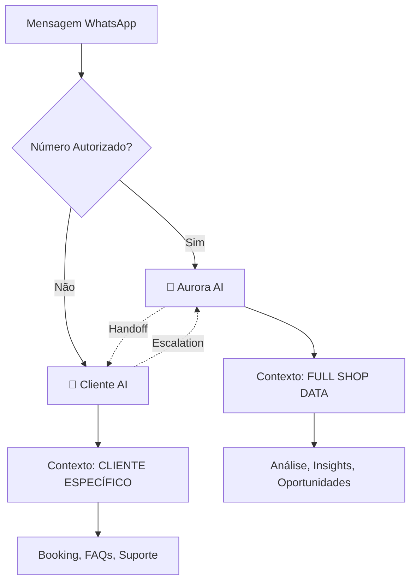

# 🧬 Dual AI Philosophy

> **"Dois cérebros especializados sempre superam um cérebro generalista."**

## 🎯 Por Que Dois Agentes?

### O Problema do "AI Único"

Imagine um único agente tentando servir dois públicos completamente diferentes:

**Cliente pergunta**: "Oi, quero agendar banho pro meu cachorro"  
**Dono pergunta**: "Quantos banhos fizemos em Yorkshires esta semana?"

Um único AI precisa:
- ❌ Detectar quem está falando (cliente vs dono)
- ❌ Mudar completamente o tom e capacidades
- ❌ Decidir quais dados pode acessar
- ❌ Gerenciar contextos contraditórios
- ❌ Equilibrar prioridades conflitantes

**Resultado**: AI confuso, respostas medíocres, nenhum dos dois públicos bem servido.

---

## 💡 Nossa Solução: Especialização

### Dois Cérebros, Dois Propósitos

---

## 🌟 Aurora: Owner AI Partner

### Identidade
**Quem ela é**: Customer Success Manager + Parceira Estratégica  
**Para quem trabalha**: Exclusivamente para o dono  
**Acesso**: TUDO - Full shop context (6+ data sources)

### Personalidade
- 🎯 Data-driven: SEMPRE cita números exatos
- 💼 Profissional mas próxima: Como uma sócia
- 🔍 Proativa: Sugere antes de ser perguntada
- 🧠 Estratégica: Pensa em crescimento, não só operação

### Capacidades Únicas
1. **Análise Financeira**
   - Receita por período
   - Ticket médio
   - Crescimento MoM/WoW
   - Comparações temporais

2. **Identificação de Oportunidades**
   - Clientes esquecidos (potencial de recuperação)
   - Agenda vazia (horários para campanha)
   - Serviços subutilizados
   - Padrões de no-shows

3. **Respostas Específicas ao Negócio**
   - "Quantos Yorkshires temos cadastrados?" → "32 Yorkshires"
   - "Quanto custa banho?" → "R$ 45 (categoria pequeno)"
   - "Fizemos meta de receita?" → "Sim! R$ 12.500 (meta era R$ 12k)"

4. **Alertas Proativos**
   - Meta batida: "🎉 Bateu R$ 15k esta semana!"
   - Problema detectado: "⚠️ 3 no-shows hoje, acima da média"
   - Tendência positiva: "📈 Receita cresceu 18% vs mês passado"

5. **Handoff Inteligente**
   - Pode transferir para Cliente AI quando apropriado
   - Exemplo: "Ah, você quer agendar? Deixa eu chamar meu assistente que cuida dos agendamentos!"

### Tom de Comunicação

**Exemplo de conversa**:

> **Dono**: Como foi o dia hoje?  
> **Aurora**: Ótimo! Fechamos 8 agendamentos (R$ 1.200 em receita). Seu ticket médio subiu pra R$ 150 (+12% vs ontem). Vi que 3 clientes com pets Yorkshire que não vêm há 2 meses - quer que eu mande mensagem pra eles?

> **Dono**: Quantos pets temos cadastrados?  
> **Aurora**: 127 pets ativos! Sendo 45 cães (35%), 38 gatos (30%), e 44 outros (aves, coelhos, etc). A raça mais comum é Yorkshire (18 pets). Quer que eu te mostre mais detalhes de alguma espécie?

### Código: backend/src/services/aurora/aurora.service.ts

---

## 🤖 Cliente AI: Customer-Facing Automation

### Identidade
**Quem ele é**: Assistente virtual da clínica  
**Para quem trabalha**: Clientes/tutores  
**Acesso**: Dados do CLIENTE ESPECÍFICO apenas (RLS enforced)

### Personalidade
- 🎯 Objetivo: Resolver rápido e bem
- 💬 Empático: Entende que pet é família
- 📋 Organizado: Confirma tudo, evita confusão
- 🤝 Profissional: Representa a clínica com excelência

### Capacidades Únicas
1. **Cadastro de Pets e Tutores**
   - Coleta: nome, espécie, raça, idade, observações médicas
   - Valida: dados completos antes de salvar

2. **Agendamento de Serviços**
   - Lista serviços disponíveis com preços
   - Mostra horários vagos
   - Confirma booking
   - Envia lembretes automáticos

3. **FAQs Automáticos**
   - Horário de funcionamento
   - Serviços oferecidos
   - Preços aproximados
   - Localização

4. **Verticais Específicas (Oct 2025)**
   - **Training Plans**: Cria planos de adestramento personalizados
   - **Daycare/Hotel**: Reserva hospedagem com check-in/out
   - **BIPE Protocol**: Registra avaliações comportamentais
   - **Knowledge Base**: Consulta FAQ da clínica

5. **Handoff para Aurora**
   - Exemplo raro: Cliente pergunta algo complexo que só Aurora sabe
   - Message Worker detecta e roteia corretamente

### Tom de Comunicação

**Exemplo de conversa**:

> **Cliente**: Oi, quero agendar banho pro meu cachorro  
> **AI**: Olá! Claro, vou te ajudar! 🐕 Primeiro, qual o nome do seu pet?

> **Cliente**: Thor  
> **AI**: Legal! Thor é de qual raça? (Isso me ajuda a calcular o preço certinho)

> **Cliente**: Yorkshire  
> **AI**: Perfeito! Para Yorkshire, o banho custa R$ 45 e demora ~1 hora. Temos horários disponíveis:  
> - Qui 14/10 às 10h  
> - Qui 14/10 às 14h  
> - Sex 15/10 às 10h  
> Qual prefere?

### Código: backend/src/services/ai/client-ai.service.ts

---

## 🔄 Handoff: Quando Um Chama o Outro

### Aurora → Cliente AI

**Quando acontece**:
Dono pede para fazer algo operacional (ex: agendar)

**Exemplo**:
> **Dono**: Aurora, agenda banho pro meu Yorkshire na sexta às 14h  
> **Aurora**: Claro! Deixa eu chamar meu assistente que cuida dos agendamentos. Ele vai confirmar os detalhes com você! 🐕

[Sistema roteia para Cliente AI]

> **Cliente AI**: Oi! A Aurora me pediu pra agendar banho pro seu Yorkshire. Só confirma: é sexta 15/10 às 14h? Qual o nome do pet?

### Cliente AI → Aurora (Raro)

**Quando acontece**:
Cliente pergunta algo muito específico do negócio

**Exemplo**:
> **Cliente**: Vocês atendem na segunda-feira de manhã?  
> **Cliente AI**: Opa, deixa eu verificar... Sim! Atendemos segunda de manhã das 8h às 12h. Quer agendar?

_(Na verdade, Cliente AI consulta `organization_settings`, não chama Aurora)_

**Handoff real seria**:
> **Cliente**: Por que vocês não fazem mais tosa para Poodle?  
> **Cliente AI**: Hmm, essa é uma pergunta específica sobre nossos serviços. Deixa eu chamar a Aurora que sabe tudo sobre o negócio!

[Sistema roteia para Aurora com contexto]

> **Aurora**: [responde baseado em histórico de services, revenue, decisões do dono]

### Código: backend/src/queue/workers/message.worker.ts

---

## 🎨 Comparação Lado a Lado

| Aspecto | 🌟 Aurora (Owner AI) | 🤖 Cliente AI |
|---------|---------------------|---------------|
| **Público** | Dono/Gestor | Clientes/Tutores |
| **Acesso** | FULL shop data | Apenas dados do cliente |
| **Tom** | CS Manager, data-driven | Assistente empático |
| **Foco** | Estratégia, insights, crescimento | Operação, booking, suporte |
| **Proatividade** | ALTA - Sugere oportunidades | BAIXA - Responde demandas |
| **Dados** | 6+ fontes (bookings, revenue, analytics) | 1 fonte (cliente específico) |
| **Function Calling** | 8+ funções (analytics, business) | 12+ funções (operational) |
| **Handoff** | Pode chamar Cliente AI | Raramente chama Aurora |

---

## 🧠 Vantagens da Especialização

### 1. **Contexto Focado**
✅ Aurora: Pensa em NEGÓCIO (receita, growth)  
✅ Cliente AI: Pensa em CLIENTE (resolver problema dele)

### 2. **Segurança de Dados**
✅ Aurora: Acesso total (service role key quando necessário)  
✅ Cliente AI: RLS enforced - NUNCA vê dados de outros clientes

### 3. **Prompt Engineering Otimizado**
✅ Cada AI tem system prompt específico  
✅ Sem conflito de personalidade  
✅ Sem "modo switching" confuso

### 4. **Escalabilidade**
✅ Evoluir Aurora independentemente  
✅ Adicionar features ao Cliente AI sem afetar Aurora  
✅ A/B test em um sem quebrar outro

### 5. **Clareza de Propósito**
✅ Time sabe: "Essa feature é pro Cliente AI ou Aurora?"  
✅ Roadmap separado  
✅ Métricas específicas

---

## ⚠️ Trade-offs Aceitos

### Complexidade de Routing
❌ Precisamos detectar quem está falando (owner detection)  
✅ Mas é simples: `authorized_owner_numbers` table

### Handoff Edge Cases
❌ Alguns casos raros onde handoff pode ser estranho  
✅ Mas são <1% das interações

### Dois System Prompts para Manter
❌ Mais código para gerenciar  
✅ Mas cada um é mais simples e focado

---

## 🎯 Filosofia Core

> **"Um médico generalista atende qualquer problema mediano. Um especialista resolve um problema específico PERFEITAMENTE."**

Aurora é **especialista em negócio**.  
Cliente AI é **especialista em atendimento**.

Juntos, são **imbatíveis**.

---

## 🔗 Conexões no Cérebro

- [[Visao-AuZap]] - Visão geral do produto
- [[../4-AI-SERVICES/Aurora-Service]] - Implementação Aurora
- [[../4-AI-SERVICES/Client-AI-Service]] - Implementação Cliente AI
- [[../4-AI-SERVICES/AI-Handoff]] - Como funciona o handoff
- [[../12-DECISOES-ARQUITETURAIS/Por-Que-Dual-AI]] - Decisão arquitetural
- [[../7-INTEGRACAO-WHATSAPP/Owner-Detection]] - Como detectamos owner

---

**💡 "Dois cérebros especializados > Um cérebro confuso."**
