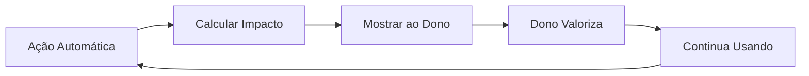

# 💎 Princípio: Impacto > Atividade

> **"O que importa não é quantas mensagens foram processadas, mas quanto tempo e dinheiro foram economizados."**

## 🎯 O Problema da Métrica Vazia

### Métricas de Atividade (❌ Ruins)
Focam no **volume de trabalho**, não no **resultado**:

- "Processamos 5.000 mensagens este mês"
- "80% de taxa de automação"
- "Tempo médio de resposta: 2 segundos"
- "20 agendamentos criados automaticamente"

**Problema**: Essas métricas não dizem nada sobre **valor real gerado**.

### Métricas de Impacto (✅ Boas)
Focam no **benefício tangível** para o negócio:

- "Economizou 12 horas de trabalho manual (R$ 600 em custo)"
- "Gerou R$ 3.200 em receita de agendamentos automáticos"
- "Recuperou 8 clientes inativos (R$ 2.400 em receita potencial)"
- "Evitou 3 no-shows com lembretes automáticos (R$ 450 salvos)"

**Benefício**: **Dono entende o valor imediatamente**.

---

## 💡 Exemplos Práticos no AuZap

### Exemplo 1: Agendamentos Automáticos

#### Métrica de Atividade ❌
> "O sistema processou 150 mensagens de agendamento este mês"

**Reação do dono**: "Ok... e daí?"

#### Métrica de Impacto ✅
> "12 agendamentos automáticos geraram R$ 1.800 em receita. Você economizou 3 horas de trabalho (R$ 150)."

**Reação do dono**: "Uau! R$ 1.950 de valor tangível!"

---

### Exemplo 2: Clientes Esquecidos

#### Métrica de Atividade ❌
> "Identificamos 45 clientes inativos e enviamos 45 mensagens de reativação"

**Reação do dono**: "Beleza..."

#### Métrica de Impacto ✅
> "8 dos 45 clientes esquecidos voltaram! Isso representa R$ 2.400 em receita recuperada que você teria perdido."

**Reação do dono**: "Isso sim faz sentido! Quanto custa pra você fazer isso todo mês?"

---

### Exemplo 3: Aurora Proativa

#### Métrica de Atividade ❌
> "Aurora enviou 30 insights proativos este mês"

**Reação do dono**: "Hmm..."

#### Métrica de Impacto ✅
> "Aurora detectou que você tinha 8 horários vagos na sexta-feira e sugeriu campanha para Yorkshires. Resultado: 5 agendamentos preenchidos (R$ 750 em receita extra)."

**Reação do dono**: "Caramba, ela é tipo uma sócia que trabalha de graça!"

---

## 🧠 Como Implementar no Código

### 1. Calcule Impacto Financeiro

Sempre que possível, **converta ação em R$**:

```typescript
// ❌ Métrica de atividade
const automatedBookings = bookings.filter(b => b.created_by === 'ai').length;
console.log(`${automatedBookings} bookings automatizados`);

// ✅ Métrica de impacto
const revenueFromAutomation = bookings
  .filter(b => b.created_by === 'ai')
  .reduce((sum, b) => sum + b.service_price_cents, 0);

const timeSaved = automatedBookings * 10; // 10min por booking manual

console.log(
  `R$ ${revenueFromAutomation / 100} gerados automaticamente. ` +
  `Economizou ${timeSaved} minutos de trabalho manual.`
);
```

### 2. Aurora SEMPRE Cita Impacto

No prompt da Aurora:

```typescript
// System prompt excerpt
"SEMPRE que apresentar dados, converta em impacto financeiro ou de tempo:
- Agendamentos → R$ em receita
- Mensagens automáticas → Horas economizadas
- Clientes recuperados → R$ que seria perdido
- Melhorias sugeridas → Potencial de ganho"
```

### 3. Dashboard Mostra Impacto, Não Atividade

Interface do dashboard:

```tsx
// ❌ Atividade
<StatCard title="Mensagens Processadas" value="1.243" />

// ✅ Impacto
<StatCard 
  title="Receita Gerada pela IA" 
  value="R$ 3.847" 
  subtitle="15 agendamentos automáticos"
/>
```

---

## 📊 Hierarquia de Métricas

### Nível 1: Dinheiro 💰 (Melhor)
- Receita gerada
- Custo economizado
- Receita recuperada (clientes esquecidos)
- Receita evitada de perder (no-shows)

### Nível 2: Tempo ⏰ (Bom)
- Horas economizadas
- Aumento de produtividade
- Redução de retrabalho

### Nível 3: Experiência 😊 (Relevante)
- Satisfação do cliente (NPS)
- Redução de estresse do dono
- Velocidade de atendimento

### Nível 4: Atividade 📈 (Informativo)
- Volume de mensagens
- Taxa de automação
- Tempo médio de resposta

**Regra**: Sempre comece com Nível 1 ou 2. Nível 3 como complemento. Nível 4 apenas para debug técnico.

---

## 🎨 Linguagem de Impacto

### Fórmulas de Comunicação

#### Receita Gerada
> "Seus agendamentos automáticos geraram **R$ X** em receita este mês."

#### Custo Evitado
> "Aurora identificou Y clientes esquecidos. Se Z voltarem, isso representa **R$ X** que você teria perdido."

#### Tempo Economizado
> "A IA respondeu N mensagens, economizando **X horas** do seu tempo."

#### Oportunidade Detectada
> "Vi que você tem agenda vazia sexta à tarde. Isso representa **R$ X** em receita potencial. Quer fazer campanha?"

---

## ⚠️ Cuidados ao Aplicar

### 1. Seja Honesto
❌ Não infle números artificialmente  
✅ Use cálculos conservadores e realistas

### 2. Mostre o Cálculo
❌ "Economizou R$ 5.000 mágicos"  
✅ "15 agendamentos × R$ 150 média = R$ 2.250 em receita automática"

### 3. Compare com Baseline
❌ "Gerou R$ 3.000"  
✅ "Gerou R$ 3.000 (+20% vs mês passado)"

### 4. Contextualize
❌ "Economizou 10 horas"  
✅ "Economizou 10 horas (equivalente a contratar alguém meio período)"

---

## 🔄 Feedback Loop



**Ciclo virtuoso**: Quanto mais você mostra impacto, mais o dono valoriza, mais ele usa, mais dados você tem para mostrar impacto.

---

## 🎓 Por Que Isso Importa?

### Para o Produto
- **Retenção**: Donos que veem impacto não cancelam
- **Upsell**: Fácil justificar planos premium
- **Word-of-mouth**: "Olha quanto eu economizei!"

### Para a IA
- **Prompt Engineering**: Aurora aprende a falar em impacto
- **Function Calling**: Funções retornam valor gerado
- **Context Building**: Sempre calcular ROI de ações

### Para o Negócio
- **Pricing**: Valor-based pricing (% de economia)
- **Marketing**: Cases reais com R$ salvos
- **Sales**: "Você vai economizar X, custa Y"

---

## 🔗 Conexões no Cérebro

- [[Visao-AuZap]] - Visão geral do produto
- [[../4-AI-SERVICES/Aurora-Service]] - Como Aurora calcula impacto
- [[../10-MONITORING-E-OPS/Performance-Targets]] - Targets técnicos que sustentam impacto
- [[../14-QUICK-REFERENCE/Glossario]] - Definições de métricas

---

**💡 "Se não gera impacto mensurável, é apenas atividade."**
