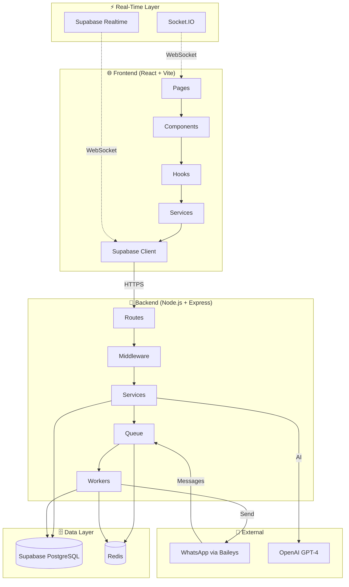
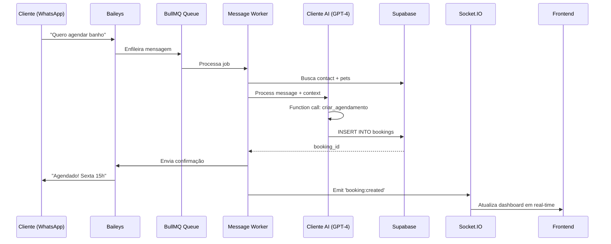
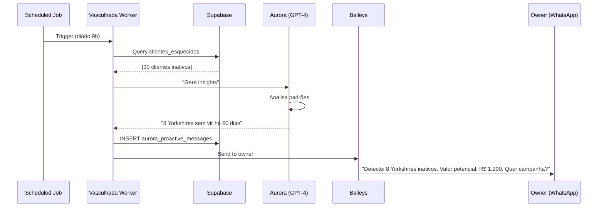

# 🏗️ Sistema Completo - Visão 360°

> **"Frontend React + Backend Node.js + Supabase PostgreSQL + Redis BullMQ + WhatsApp Baileys + Dual AI"**

## 🎨 Arquitetura de Alto Nível



## 📦 Componentes Principais

### 1. Frontend (src/)
**Stack**: React 18 + Vite + TypeScript + Tailwind + shadcn/ui

**Estrutura**:
```
src/
├── pages/              # 20+ route pages
├── components/         # 60+ components (ui/ + business/)
├── hooks/             # Custom React hooks (queries, subscriptions)
├── services/          # API layer (fetch wrappers)
├── lib/               # Utils (socket, api, supabase client)
└── integrations/      # Supabase types
```

**Responsabilidades**:
- Render UI (dashboards, forms, charts)
- Consume backend APIs (HTTPS)
- Subscribe to real-time (Socket.IO + Supabase)
- Manage client state (React Query)

**Deploy**: Render Static Site

---

### 2. Backend (backend/src/)
**Stack**: Node.js 20 + Express + TypeScript + Baileys + BullMQ

**Estrutura**:
```
backend/src/
├── config/            # Clients (supabase, redis, openai)
├── middleware/        # Auth, tenant, rate-limiting
├── routes/           # Express endpoints (REST APIs)
├── services/         # Business logic (15+ services)
├── queue/            # BullMQ setup + workers + jobs
├── types/            # TypeScript definitions
└── server.ts         # Express + Socket.IO entry
```

**Responsabilidades**:
- Expose REST APIs
- Authenticate requests (JWT)
- Enforce multi-tenancy (RLS + middleware)
- Process WhatsApp messages (Baileys)
- Run AI (OpenAI GPT-4)
- Emit real-time events (Socket.IO)

**Deploy**: Render Web Service + Background Workers

---

### 3. Database (Supabase PostgreSQL)
**19 Tabelas** organizadas em 5 grupos:

- **Core** (6): organizations, users, settings, whatsapp_instances, services, authorized_owner_numbers
- **Clientes** (3): contacts, pets, bookings
- **WhatsApp** (4): conversations, messages, ai_interactions, scheduled_followups
- **Aurora** (2): aurora_proactive_messages, aurora_automations
- **Verticals** (4): training_plans, daycare_hotel_stays, bipe_protocol, knowledge_base

**Features**:
- Row Level Security (RLS) em todas as tabelas
- 60+ índices otimizados
- Materialized views para analytics
- Audit trail imutável

Veja: [[../3-DATABASE-E-DADOS/Schema-Overview]]

---

### 4. Queue System (Redis + BullMQ)
**Propósito**: Processamento assíncrono resiliente

**Workers**:
1. **Message Worker** (Priority 1) - Processa mensagens WhatsApp
2. **Campaign Worker** (Priority 2) - Envia campanhas em massa
3. **Automation Worker** (Priority 3) - Executa automações
4. **Vasculhada Worker** (Priority 4) - Recupera clientes esquecidos

**Jobs Agendados**:
- WhatsApp health check (a cada 5min)
- Aurora daily summary (18h)
- Aurora opportunities detection (diário)

Veja: [[../5-WORKERS-E-QUEUES/BullMQ-Architecture]]

---

### 5. WhatsApp Integration (Baileys)
**Protocolo**: Nativo WhatsApp (não API oficial)

**Features**:
- Pairing code (8 dígitos, não QR)
- Session persistence (Render Disk)
- Auto-reconnection
- Multi-instance (um por organization)

**Flow**: WhatsApp → Baileys → BullMQ → Message Worker → AI → Response

Veja: [[../7-INTEGRACAO-WHATSAPP/Baileys-Service]]

---

### 6. AI Services (OpenAI GPT-4)
**Dois agentes especializados**:

**Aurora** (Owner AI):
- Acesso: FULL shop context (6+ data sources)
- 8+ funções (analytics, business intelligence)
- Tom: CS Manager data-driven

**Cliente AI** (Customer-facing):
- Acesso: Cliente específico apenas (RLS)
- 12+ funções (booking, training, daycare, bipe, kb)
- Tom: Assistente empático

Veja: [[../4-AI-SERVICES/Aurora-Service]] | [[../4-AI-SERVICES/Client-AI-Service]]

---

## 🔄 Fluxo de Dados Completo

### Exemplo: Cliente Agenda Banho



### Exemplo: Aurora Identifica Oportunidade



---

## 🔒 Security Layers

### 1. **Database Level (RLS)**
- PostgreSQL Row Level Security
- Filtra por organization_id automaticamente
- Impossível leak cross-tenant no banco

### 2. **Application Level (Middleware)**
- `TenantMiddleware`: Extrai organizationId do JWT
- `AuroraAuthMiddleware`: Verifica authorized_owner_numbers
- `AdminAuthMiddleware`: Valida permissões admin

### 3. **Service Level (TenantAwareSupabase)**
- Wrapper que força filtro por organization_id
- DX que previne esquecimento

### 4. **Rate Limiting**
- Per-endpoint limits
- Organization-based quotas
- Previne abuse

Veja: [[Multi-Tenancy-RLS]]

---

## ⚡ Real-Time Strategy

### Dual Strategy (Socket.IO + Supabase Realtime)

**Socket.IO** (backend/src/server.ts):
- WhatsApp connection status
- Queue progress
- Aurora proactive messages
- Custom business events

**Supabase Realtime**:
- Database changes (INSERT, UPDATE, DELETE)
- Tables: messages, conversations, bookings, pets, contacts
- Filtered by organization_id

**Por que dois?**
- Socket.IO: Eventos custom do backend
- Supabase: Database changes automáticas
- Juntos: Cobertura completa sem duplicação

Veja: [[Real-Time-Strategy]]

---

## 🚀 Deploy Architecture (Render)

### Web Service (backend)
- Container: Docker multi-stage build
- Health checks: /health, /health/redis, /health/supabase
- Persistent disk: /app/sessions (1GB Baileys auth)
- Auto-scaling: 1-5 instances

### Background Workers (backend)
- Mesmo codebase, diferentes entry points
- npm run workers:start
- Processa queues BullMQ
- Não expõe HTTP

### Static Site (frontend)
- Build: npm run build → dist/
- CDN: Render CDN global
- SPA routing: Serve index.html para todas as rotas

**Environments**:
- Develop branch → Staging (auto-deploy)
- Main branch → Production (manual trigger)

Veja: [[../8-DEPLOY-E-INFRA/Render-Setup]]

---

## 📊 Performance Targets

| Métrica | Target | Como Medir |
|---------|--------|------------|
| API Response | <200ms (p95) | Winston logs |
| Database Query | <50ms (indexed) | EXPLAIN ANALYZE |
| Queue Processing | <5s per message | Bull Board |
| WhatsApp Send | <1s | Baileys logs |
| Frontend FCP | <2s | Lighthouse |

Veja: [[../10-MONITORING-E-OPS/Performance-Targets]]

---

## 🎯 Tech Stack Completo

### Backend
- **Runtime**: Node.js 20 + ESM modules
- **Framework**: Express 4.21
- **Language**: TypeScript 5.8 (strict mode)
- **WhatsApp**: @whiskeysockets/baileys 6.7.9
- **AI**: OpenAI 4.73 (GPT-4 + functions)
- **Queue**: BullMQ 5.59 + IORedis 5.8
- **Database**: @supabase/supabase-js 2.58
- **Real-time**: Socket.IO 4.8
- **Auth**: JWT + bcrypt
- **Logging**: Pino 9.6 (JSON structured)

### Frontend
- **Framework**: React 18.3 + Vite 5.4
- **UI**: shadcn/ui + Radix UI primitives
- **Styling**: Tailwind CSS 3.4
- **Routing**: React Router DOM 6.30
- **State**: @tanstack/react-query 5.83
- **Forms**: react-hook-form 7.61 + zod
- **Charts**: Recharts 2.15
- **Calendar**: react-big-calendar 1.19
- **WebSocket**: socket.io-client 4.8

### Infrastructure
- **Hosting**: Render (Web + Workers + Static)
- **Database**: Supabase PostgreSQL 15
- **Queue/Cache**: Upstash Redis (Serverless)
- **Storage**: Supabase Storage
- **Monitoring**: Winston JSON + Render Logs

Veja: [[Tech-Stack-Completa]]

---

## 🔗 Conexões no Cérebro

- [[Message-Flow]] - Fluxo detalhado de mensagens
- [[Multi-Tenancy-RLS]] - Arquitetura multi-tenant
- [[Real-Time-Strategy]] - Socket.IO + Supabase strategy
- [[Tech-Stack-Completa]] - Stack completo detalhado
- [[../3-DATABASE-E-DADOS/Schema-Overview]] - Database schema
- [[../4-AI-SERVICES/Aurora-Service]] - Aurora AI
- [[../5-WORKERS-E-QUEUES/BullMQ-Architecture]] - Queue system
- [[../7-INTEGRACAO-WHATSAPP/Baileys-Service]] - WhatsApp integration

---

**🏗️ "Arquitetura não é sobre tecnologia. É sobre resolver problemas reais de forma elegante."**
